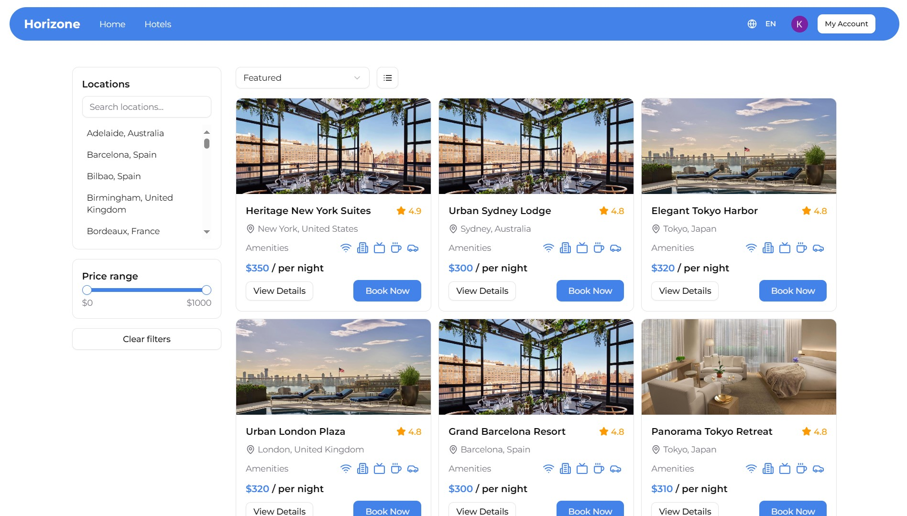

# AI Smart Hotel Platform - (Clerk | Stripe | Netlify | Render)

 

> A smart, AI-powered MERN hotel booking platform designed to simplify the user experience of finding amazing hotels all over the world. The **AI search bar** can be used to find hotels matching detailed user request, browse hotel listings with advanced filtering, and secure bookings via **Stripe's payment gateway**. This is the **Frontend** repository, built on React with responsive design for a seamless user experience.

## 🎯 The Vision: Seamless & Smart Travel Booking

### The Challenge: Overwhelming & Rigid Search
Traditional booking sites often offer rigid, keyword-based searches that fail to capture the nuanced needs of a traveler (e.g., "a cozy, quiet room with a coffee maker and a great city view"). This often leads to extensive manual filtering and a frustrating user journey to find the perfect stay.

### Our Solution: AI-Powered Discovery & Robust Features
- **Personalized Discovery** → 
    - The **AI search bar** allows users to input natural, detailed prompts, like "Suggest a highly-rated, budget-friendly hotel near the beach with free Wi-Fi and parking." 
    - The system uses **embedding** to match their query to hotel data, simplifying the search process.
- **Scalable Browsing** → 
    - Features like **pagination**, a **toggleable grid/list view**, and filters (price, rating, alphabetical) ensure a fast and efficient browsing experience even as the number of listings grows.
- **Secure & Trackable Bookings** → 
    - **Stripe integration** ensures secure payment processing. 
    - While the dedicated **My Account Page** provides a clear, paginated history of both upcoming and past bookings.

## ✨ Core Features
This is a comprehensive overview of the main functionalities built into the platform.
* **AI Search & Filtering** → Detailed, natural language search for hotels using AI for criteria matching, alongside standard filters (price $\uparrow/\downarrow$, rating $\downarrow$, A-Z, featured).
* **Dynamic Hotel Listings** → Displays hotels in a Grid or List view, with pagination for scalable browsing and dedicated HotelCard components for reusability.
* **Secure Booking System** → Authenticated users can make secure bookings with a real-time status tracker (pending/paid) and Stripe integration for payment.
* **Intuitive Location Filtering** → Easily search by city or country with a flexible backend query parser and dedicated country-select buttons on the homepage.
* **User Account Management** → A dedicated page for viewing all booking history and managing profile information via Clerk's built-in components.
* **Performance & UX** → Utilizes skeleton loaders on all pages, memoization, and debounce on the hotel page for a fast, accessible, and smooth user experience.

## 🖼️ User Flow & Pages
- **Home-Page** (landing page) → features hero image carousel, AI Search Bar & hotel grid with country filter.
- **Hotel-Page** → 
  - Hotel listings cards are displayed & switch between Grid View and List View. 
  - Dropdown to sort by Price $\uparrow/\downarrow$ , Rating $\uparrow$ , Alphabetical (A-Z), or Featured with Clear Filters button.
- **Hotel-Details-Page** → complete information of a selected hotel with book now & reviews section.
- **My-Account-Page** → contains Booking History & clerk user Account Management.

## 🛠️ Tech Stack & Architecture
This section details the technologies used specifically in this repository.
  * **Framework** → Vite + ReactJS (JSX)
  * **Styling** → Tailwind CSS with Shadcn UI Components
  * **State Management** → Zustand, Redux Toolkit (Global state) & React RTK Query (Data Fetching/Caching)
  * **Routing** → React Router DOM
  * **Forms & Validation** → React Hook Form with Zod
  * **Authentication** → Clerk's built-in components for user authentication
  * **Deployment** → Netlify 🔗 [Client App](https://aidf-5-front-end-iroshan.netlify.app) 

## 🔗 Backend API
This frontend application communicates with a separate API built with Node.js and MongoDB. You can find the backend repo from below.

**Backend Repository** → 🔗 [ckiroshan/AI-Financial-Tracker-Backend](https://github.com/ckiroshan/aidf-5-back-end)

## 💡 Challenges & Learnings

The project presented several opportunities for technical growth and problem-solving:
* **Stripe Integration:** Successfully implementing the secure payment flow, including handling webhooks for post-payment status updates.
* **AI Model Integration:** Leveraging AI embeddings to process complex user prompts and filter hotel records based on semantic matching.
* **Clerk Authentication:** Deep understanding and implementation of Clerk for both front-end access control (ProtectLayout) and backend validation (Middleware).
* **UI/UX with shadcn/ui:** Utilizing the shadcn/ui library and React Hook Form to quickly build accessible, well-validated forms and a cohesive user interface.

## 🚀 Future Enhancements
Potential areas for continued development and feature expansion:
* **Real-time Availability:** Integrate a system to check room availability in real-time before booking confirmation.
* **Hotel-Enlister's Dashboard:** Create a dedicated dashboard for hotel owners to manage their listings, pricing, and view booking metrics.
* **Advanced Review System:** Implement features like review upvoting, verified booking badges, and more detailed review breakdown (e.g., cleanliness rating).
* **Geolocation Search:** Utilize the embedded location data to implement a "Hotels Near Me" feature using the user's current location.

## 👨‍💻 Purpose & Contribution
This project was built as I was learning from an AI Bootcamp where I was introduced to cool ways of integrating AI features to full stack applications. Currently this project doesn't accept external contributions or pull requests. Thank you.
